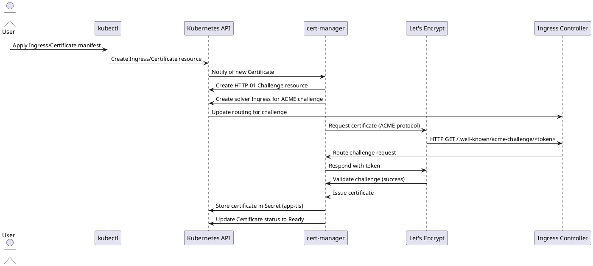

# Certificate Issuance Sequence Diagram (PlantUML)

```plantuml
@startuml
actor User
participant "kubectl" as Kubectl
participant "Kubernetes API" as K8s
participant "cert-manager" as CertManager
participant "Let's Encrypt" as LE
participant "Ingress Controller" as Ingress

User -> Kubectl: Apply Ingress/Certificate manifest
Kubectl -> K8s: Create Ingress/Certificate resource
K8s -> CertManager: Notify of new Certificate
CertManager -> K8s: Create HTTP-01 Challenge resource
CertManager -> K8s: Create solver Ingress for ACME challenge
K8s -> Ingress: Update routing for challenge
CertManager -> LE: Request certificate (ACME protocol)
LE -> Ingress: HTTP GET /.well-known/acme-challenge/<token>
Ingress -> CertManager: Route challenge request
CertManager -> LE: Respond with token
LE -> CertManager: Validate challenge (success)
LE -> CertManager: Issue certificate
CertManager -> K8s: Store certificate in Secret (app-tls)
CertManager -> K8s: Update Certificate status to Ready
@enduml
```

Copy this code block into any PlantUML-compatible renderer or Markdown viewer with PlantUML support to visualize the sequence diagram.
